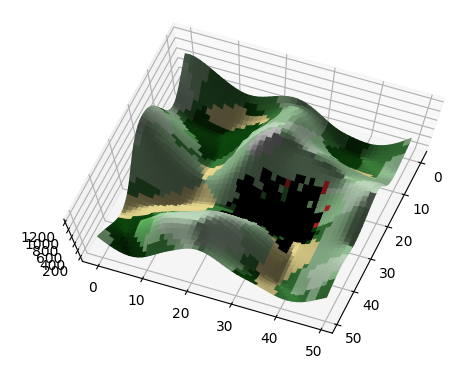

# Wildfire simulation using CAs (Project CompSci 2020)

</img>

## Authors

* Ben Wiersma (10718087)
* Jari Maijenburg (11217189)
* Youri Moll (10714235)

## Research

Before development started, we did a lot of research on wildfires and wildfire simulations. We compiled this research into a PDF which can be found at the root of this repository (Initial\_research.pdf).

## Prerequisites

What you will need before you can run this code
- Python 3
- Pip for Python 3

## Running this program

To setup the environment:
```bash
make env
source env/bin/activate
make build
```

To run the program:
```bash
python3 wildfire_simulator <grid_file> [interval]
```

where `grid_file` is the path to one of the JSON files in the grids folder that describe a landscape and `interval` is an optional argument which sets the amount of time in ms per frame of the simulation (lower is faster, default is 100 ms). We recommend using `girds/hilly_small.json` as a good example.

## Generating a landscape

To generate a landscape to run the wildfire simulator in, you can use the script `grids/generate_random_grid.py`. Run `./grids/generate_random_grid.py -h` for more information.

## Acknowledgments

This program is based on [this research](https://www.nat-hazards-earth-syst-sci.net/19/169/2019/) by Joana Gouveia Freire and Carlos Castro DaCamara at the University of Lisbon.

Thanks to Amit Patel for [this excelent information](https://www.redblobgames.com/maps/terrain-from-noise/) on generating landscapes with Perlin noise.
